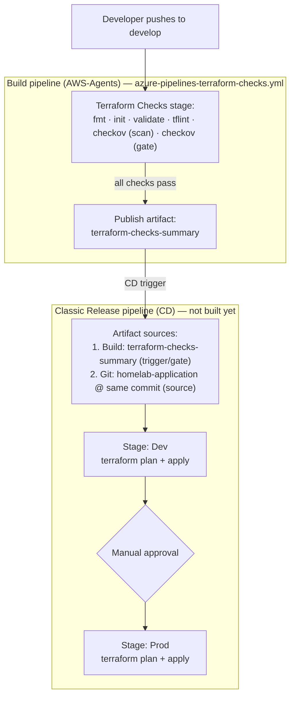

# Terraform Checks — Tool Reference

`pipelines/azure-pipelines-terraform-checks.yml` runs on every push to
`develop`, on the self-hosted `AWS-Agents` pool. The starting need was
simple: a way to check Terraform-defined IAM policies for problems —
overly-broad wildcards especially — before they reach production. That
search led to Checkov, which turned out to cover far more than just IAM (a
general IaC security scanner: public buckets, unencrypted resources, and so
on, alongside the IAM checks). TFLint was added separately for a different,
non-overlapping gap Checkov doesn't touch at all: Terraform correctness and
code quality, not security.

This became a priority now rather than a someday-nice-to-have because one
of exactly those wildcard IAM permissions — referenced into this repo's
Terraform from a developer's manually-created dev resources, with nobody
checking whether the permissions that came along with them were
appropriate — was later flagged by Security in production.

None of the tools it uses are pre-installed on the agent, so each is
downloaded and pinned to a specific version immediately before its first
use (see the `Install <tool> $(...)` steps in the pipeline YAML).

## Terraform — `fmt`, `init`, `validate`

**What it is:** The infrastructure-as-code tool itself. Not a separate
product here — `fmt`/`validate` are built-in Terraform subcommands, not a
third-party addition.

**Why we run it in CI:**

- `fmt -check -recursive` — canonical formatting. Catches drift before it
  turns into a noisy diff later; doesn't touch files, just fails if they're
  not already formatted (`terraform fmt` with no `-check` rewrites them).
- `init -backend=false` — downloads the providers referenced in the config,
  without needing real backend/state credentials on the CI agent. Just
  enough to make `validate` possible.
- `validate` — checks the HCL is syntactically valid and internally
  consistent (references resolve, required arguments are present). It does
  **not** check whether the values are ones AWS will actually accept, or
  whether the change is safe to apply — that's what the tools below are for.

**Run it yourself, locally:**

```bash
terraform fmt -check -recursive              # from the repo root
cd envs/dev
terraform init -backend=false
terraform validate
```

---

## TFLint

**What it is:** A pluggable linter for Terraform. Where `terraform validate`
only checks that the HCL is well-formed, TFLint understands the actual
shape of a provider's API — it can tell you an instance type doesn't exist,
an argument is deprecated, or a variable is declared but never used, all
without ever calling AWS.

**Why we use it:** Catches real mistakes `validate` structurally can't see,
before they reach a human reviewer or a `terraform plan`.

**Who builds it:** Started as a solo project by developer `wata727`; now
maintained by the community under the [`terraform-linters`](https://github.com/terraform-linters/tflint)
GitHub organization, with the original author still an active contributor.
Open source, MPL-2.0.

**How we run it:**

```bash
tflint --recursive --minimum-failure-severity=error
```

`--minimum-failure-severity=error` means only `error`-level findings fail
the build — `warning`/`notice` findings still print in the log but don't
block. Two rules are disabled entirely via `.tflint.hcl` at the repo root
(`terraform_required_version`, `terraform_required_providers`) — they want
every module to redeclare version constraints the root already declares,
which doesn't apply cleanly to modules that are only ever consumed locally
by this one root.

**Run it yourself, locally:** same command as above, from the repo root
(needs `tflint` installed — see [releases](https://github.com/terraform-linters/tflint/releases)).

---

## Checkov

**What it is:** A static-analysis security and compliance scanner for
infrastructure-as-code (Terraform, CloudFormation, Kubernetes, and more). It
doesn't care whether the HCL is well-formed — it cares whether the
infrastructure it describes is a security risk: public buckets, unencrypted
resources, IAM grants wider than they need to be.

**Why we use it:** This is the check that's actually supposed to catch
things like the wildcard IAM permission that started this initiative.

**Who builds it:** Built by Bridgecrew, launched Dec 2019; Bridgecrew was
acquired by Palo Alto Networks in March 2021 and folded into Prisma Cloud.
The CLI stayed free and open source (Apache-2.0). 80M+ downloads since
launch, across hundreds of built-in AWS/Azure/GCP/Kubernetes policies.

**How we run it — two passes:**

1. **Advisory scan** (full default ruleset, doesn't block the build):

   ```bash
   checkov -d . --compact --quiet
   ```

2. **Blocking gate** (only these checks fail the build):

   ```bash
   checkov -d . --check CKV_AWS_40,CKV_AWS_1,CKV_AWS_62,CKV_AWS_63,CKV_AWS_355 --compact --quiet
   ```

| Check         | Catches                                                                                                          |
| ------------- | ----------------------------------------------------------------------------------------------------------------- |
| `CKV_AWS_62`  | IAM policy allows full admin — wildcard action **and** wildcard resource together (the exact pattern Security flagged) |
| `CKV_AWS_63`  | IAM policy statement uses `"*"` as its action                                                                   |
| `CKV_AWS_355` | IAM policy statement uses `"*"` as its resource, for an action that supports scoping                            |
| `CKV_AWS_40`  | IAM policy attached directly to a user instead of a role/group                                                  |
| `CKV_AWS_1`   | S3 bucket policy allows public access                                                                           |

**Suppressed checks** (documented in `.checkov.yaml` at the repo root, with
the reason inline as a comment — not silently skipped):

| Check         | Why suppressed                                                                                        |
| ------------- | -------------------------------------------------------------------------------------------------------- |
| `CKV_AWS_117` | Lambda not deployed inside a VPC — `modules/vpc` is an intentionally unused passthrough for this POC  |
| `CKV_AWS_338` | CloudWatch log retention under 1 year — 14-day default is a deliberate homelab cost tradeoff           |
| `CKV_AWS_1`   | S3 bucket policy allows public access — `modules/portfolio_site` is an intentional public S3 static website hosting bucket, meant to sit behind Cloudflare later |

**Run it yourself, locally:**

```bash
pip install checkov
checkov -d . --compact --quiet                                              # full scan
checkov -d . --check CKV_AWS_40,CKV_AWS_1,CKV_AWS_62,CKV_AWS_63,CKV_AWS_355 --compact --quiet  # just the gate
```

---

## Adding or changing a blocking check

1. Find the check ID on the [Checkov policy index](https://www.checkov.io/5.Policy%20Index/terraform.html).
2. Add it to the `--check` list in the blocking `checkov` step in
   `pipelines/azure-pipelines-terraform-checks.yml`, and update the comment
   below that step.
3. If a check doesn't apply to this repo's architecture, add it to
   `.checkov.yaml`'s `skip-check` list instead — with a one-line reason as
   an inline comment, not silently.

---

## How this fits into CD (not built yet)

This pipeline only checks and reports — it never runs `terraform apply`.
The `terraform-checks-summary` artifact it publishes on success is designed
to be the trigger for a downstream **Classic Release pipeline** (Azure
DevOps' UI-defined multi-stage release construct) that would actually
deploy.

The one non-obvious part: a Classic Release pipeline needs two separate
artifact sources, not one. The `terraform-checks-summary` artifact proves
the commit passed the gate and triggers the release, but it isn't the
Terraform source itself — this build deliberately doesn't publish a copy of
`envs/`/`modules/`/`ssm_template/` (see "Publish Checks Summary" in the
pipeline YAML). So the Release definition also links the Git repository
directly as a second artifact source, checked out at that same commit, to
get the actual files `terraform plan`/`apply` needs.



If a check fails, the build stops before the "Publish artifact" step, so
there's nothing for the Release pipeline to trigger on — a broken commit
never reaches Dev or Prod.
